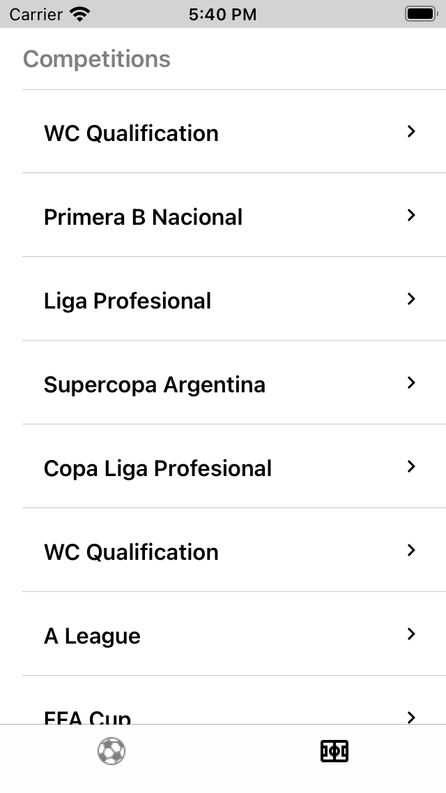
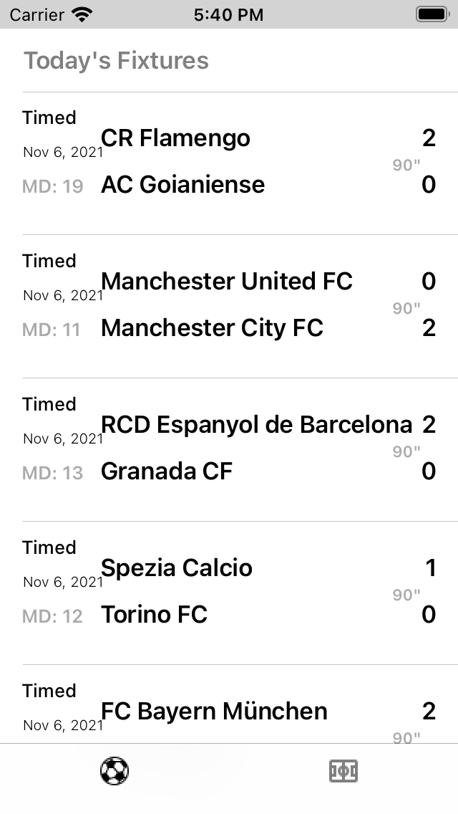

# FootBallFixturesApp
Display Football Data such as today's Match, Competition list using football Data API and Swift

<!-- <p align="center"><a href="#" rel="nofollow"></a> <a href="#" rel="nofollow"></a></p> -->
 


## Architecture 
MVVM

## Folder Structure
Manager <br>
Utilities <br>
NetworkManager <br>
Model <br>
ViewModel <br>
Controller <br>
View <br>
UnitTest


## Requirements
macOS 10.15
Xcode 11
iOS 13

## Usage 
Clone the repository:

``` git clone https://github.com/ayodejiayankola/FootBallFixturesApp.git ```

## Installations

### CocoaPods
You can use CocoaPods to install YourLibrary by adding it to your Podfile:

```
platform :ios, '9.0'
use_frameworks!
pod 'RealmSwift', '~>10' 
```

## Getting Started
Clone the Repository<br>
Get the API Key from https://www.football-data.org <br>
Put API Key in  Config.swift  on line 12 inside the NetworkServiceManager Folder<br>
